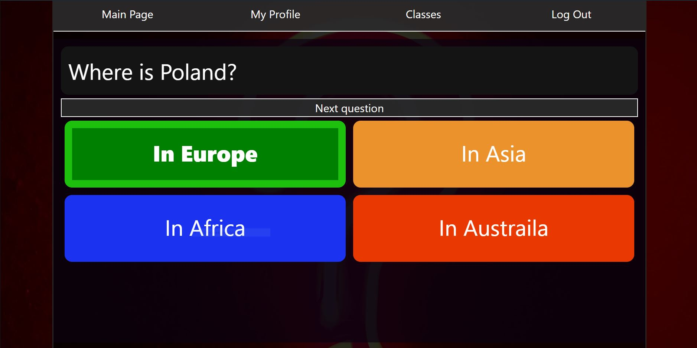

# Quizk
## Table of contents
* [General info](#general-info)
* [Technologies](#technologies)
* [How to use this app?](#how-to-use-schegen)
* [Setup](#setup)
* [Image](#image)

## General info
Simple quiz app

## Technologies
* Django
* Django resrframework
* Bootstrap4

## How to use this app?
1. Download this repo and setup it
2. Register 
3. Login
4. Create Quiz
5. Add questions to quiz
6. Start Quiz

## Setup
* python -m venv venv   
* source venv/scripts/activate
* python -m pip install --upgrade pip
* pip install -r requirements.txt
* python manage.py makemigrations
* python manage.py migrate
* python manage.py runserver

## Image
